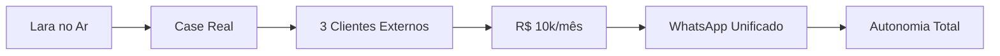

# Metas de Longo Prazo

> A bússola. Mantém o norte visível contra a reatividade do TDAH.

## 1. O Número da Autonomia (R$ 10k/mês)
Meta alvo para **Set-Out/2026** (6 meses). Foco em autonomia total e saída de casa.

| Marco | Valor | Impacto |
|-------|-------|-------------------|
| Atual | ~R$ 2.100 | Base (Holos + Unimasso) |
| Marco 1 | R$ 3.000 | Aporte 20% em FIIs |
| Marco 2 | R$ 5.000 | Quitar dívidas + Reserva 3 meses |
| Marco 3 | R$ 10.000 | Autonomia total + Sair de casa |

### Projeção de Fontes
- **Holos (Fixo):** R$ 1.500.
- **15% EAD Holos:** R$ 500 – 1.000.
- **Clientes Externos (3):** R$ 2.000 – 3.000 cada.
- **Unimasso:** Participação (pós-case EAD).

## 2. Roadmap de Projetos

### Prazos Críticos
- **Abril/26:** Lara Comercial 2 e Bumblebee no ar.
- **Maio/26:** Lançamento EAD Holos (Fórmula de Lançamento).
- **Jun-Jul/26:** Cliente Externo #1 fechado.
- **Ago/26:** Cliente Externo #3 fechado.

## 3. Carreira & Hábitos
- **Autoridade:** Cases documentados + Presença digital (LinkedIn/IG).
- **Hábitos:** 10 páginas/dia leitura. 20% teoria / 80% prática.
- **Regra:** Aplicar cursos (ERA, FL, VTSD) antes de comprar novos.
Execução mensal → [[01 - Profissional/Areas/Estrategia/Planejamento Master]] · Laboratório central → [[01 - Profissional/Projetos/Holos/Holos]]

---
[[01 - Profissional/Areas/Estrategia/Planejamento Master]] | [[01 - Profissional/Areas/Financeiro/Financeiro]] | [[01 - Profissional/Projetos/Holos/Holos]]
