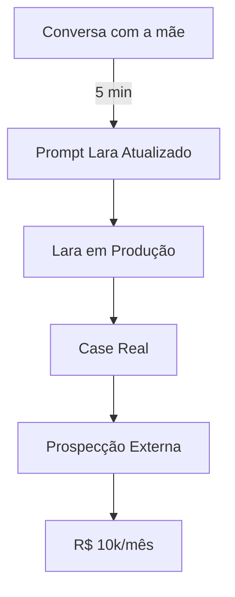

# Planejamento Master

> Sistema operacional do negócio. Organiza por prioridade real (0→6). Resolve o bloqueio de início do TDAH.

## 1. Gargalo Central (Desbloqueio)

## 2. Metas Abril 2026
- [ ] **iPhone:** Conserto (~R$ 600) → Venda com lucro.
- [ ] **Bicicleta:** Conserto (~R$ 60) → Operacional.
- [ ] **CNH:** Iniciar processo (Taxas/Docs).
- [ ] **1ª Venda:** Fechar 1 matrícula via base ZenPro (Holos).
- [ ] **Negociação EAD:** Proposta de 15% de comissão formal com a Tia.

## 3. Matriz de Prioridades
| Nível | Foco | Ação Chave |
| :--- | :--- | :--- |
| **P0** | **Desbloqueio** | Conversa com a mãe (3 perguntas). |
| **P1** | **Lara Comercial** | Teste end-to-end e ativação no Comercial 2. |
| **P2** | **SEO (Bumblebee)** | Conectar 2 posts/dia no WordPress Holos. |
| **P3** | **Interno Holos** | Lançamento EAD via base ZenPro (5.768 contatos). |
| **P4** | **Unimasso** | WordPress + Bumblebee integrado. |
| **P5** | **Expansão** | Fechar 1º cliente externo (pós-case Holos). |

## 4. Squads & Decisões
- **Copy-Master:** Acionar para prompt final da Lara após conversa com a mãe.
- **Hormozi-Squad:** Estruturar oferta EAD e precificação (15% comissão).
- **Advisory-Board:** Acionar para decisão de escala ao atingir R$ 3k/mês.
Bússola de longo prazo → [[01 - Profissional/Areas/Estrategia/Metas de Longo Prazo]] · Script de conversa com a mãe → [[01 - Profissional/Projetos/Holos/Holos - Sistema Técnico]] · Expansão → [[01 - Profissional/Projetos/Clientes Externos/Prospecção Ativa]]

---
[[01 - Profissional/Projetos/Lara Comercial]] | [[01 - Profissional/Areas/Estrategia/Prioridades da Semana]] | [[01 - Profissional/Areas/Financeiro/Financeiro]]
