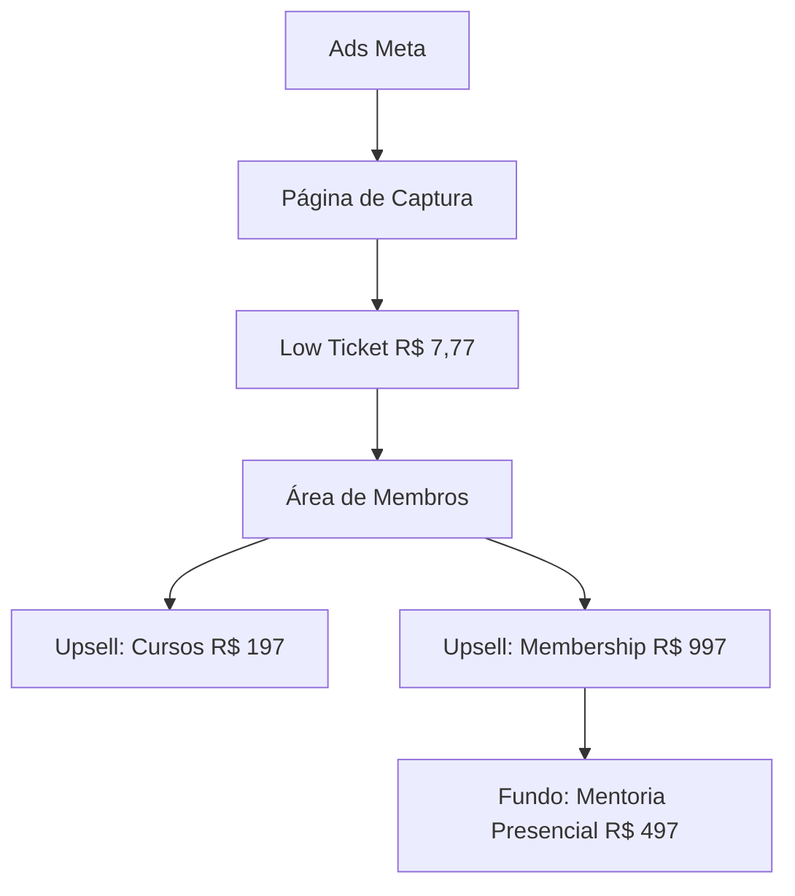

# Holos — Funil Digital

> Ecossistema de infoprodutos. Escala nacional via atrito zero e upsell.

## 1. Escada de Valor Digital

## 2. Diferenciais do Modelo
- **Atrito Zero (R$ 7,77):** Facilita a entrada do lead no ecossistema.
- **Unimasso Trial:** Ativa o flywheel no momento da entrada.
- **Lara Qualification:** Valida demanda antes de escalar tráfego pago.
- **Ativo:** Câmera de R$ 5.000 já disponível para produção de conteúdo.

## 3. Pré-requisitos e Metas
| Pré-requisito | Status | Importância |
| :--- | :--- | :--- |
| Lara no Ar | ⏳ Em curso | Validação de demanda. |
| Negociação 15% EAD | ⏳ Pendente | R$ 500-1.000/mês para Nicolas. |
| Branding Holos | ⏳ Pendente | Unificação da mensagem. |
| Fórmula de Lançamento | ⏳ Pendente | Aceleração de vendas. |
Fase 3 (Escala) → [[01 - Profissional/Projetos/Holos/Holos - Estratégia 90 Dias]] · Unimasso Trial → [[01 - Profissional/Projetos/Unimasso/Unimasso]] · Comissão 15% → [[01 - Profissional/Areas/Financeiro/Financeiro]]

---
[[01 - Profissional/Projetos/Holos/Holos - Estratégia 90 Dias]] | [[01 - Profissional/Projetos/Unimasso/Unimasso]] | [[01 - Profissional/Projetos/Lara Comercial]]
