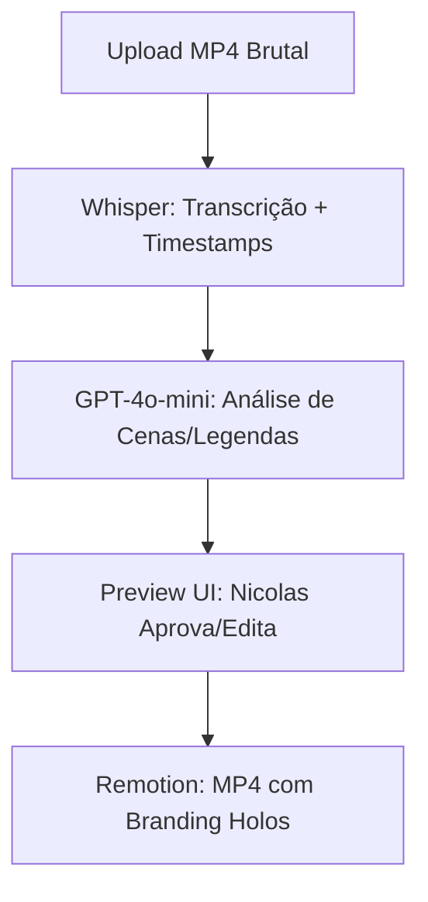

# Content Agent Holos — Pipeline de Conteúdo com IA

> Produção de MP4 automatizada. Upload → Transcrição → Legenda → Render.

## 1. Localização e Infraestrutura
- **Path:** `C:\Users\lugzi\dev\projetos\holos-content-agent\`
- **Backend:** Node.js + Express (Porta 4000)
- **Frontend:** React + Vite / Remotion Studio (Porta 3000)
- **Custo Operacional:** ~R$ 1,50 por vídeo (Whisper + GPT).

## 2. Pipeline de Produção (Editor Inteligente)

- **Tempo Total:** 5-10 minutos por vídeo.

## 3. Vídeo Promocional Animado (HolosFormacao)
Composição de 7 cenas (sem footage).
- **Áudio:** OpenAI TTS (voz `shimmer`, speed 0.88) + FFMPEG 432Hz (216, 432, 648, 864 Hz).
- **Sincronia:** Whisper Timestamps JSON.
- **Output:** `output/holos-formacao-sync.mp4`.

## 4. Comandos de Operação (Literais)
```bash
# Iniciar Editor
npm run server        # backend na 4000
npx remotion dev      # Remotion Studio no 3000

# Gerar Vídeo Promocional
python gerar-audio.py
python sincronizar-audio.py
npx remotion render src/index.ts HolosFormacao output/holos-formacao.mp4
```

Estratégia que alimenta → [[Holos/Holos - Estratégia de Conteúdo]] · Arquitetura base → [[Editor de Video Local/Editor de Vídeo Local]]

---
